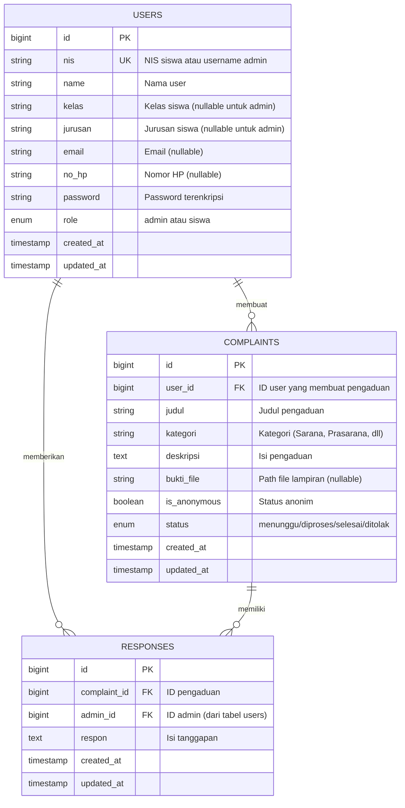

# Entity Relationship Diagram (ERD) - Sarana Pengaduan Sekolah

## Diagram ERD

## Penjelasan Struktur Database

### 1. Tabel USERS
**Fungsi:** Menyimpan data Admin dan Siswa dalam satu tabel dengan pembeda kolom `role`.

**Kolom Utama:**
- `id`: Primary key auto-increment
- `nis`: Nomor Induk Siswa (untuk siswa) atau username (untuk admin), bersifat unique
- `name`: Nama lengkap user
- `role`: Pembeda antara 'admin' dan 'siswa'
- `kelas` & `jurusan`: Khusus untuk siswa (nullable untuk admin)

**Relasi:**
- **1 User → N Complaints**: Satu user (siswa) dapat membuat banyak pengaduan
- **1 Admin → N Responses**: Satu admin dapat memberikan banyak tanggapan

### 2. Tabel COMPLAINTS
**Fungsi:** Menyimpan semua pengaduan/aspirasi dari siswa.

**Kolom Utama:**
- `id`: Primary key auto-increment
- `user_id`: Foreign key ke tabel users (siswa yang membuat)
- `kategori`: Jenis pengaduan (Sarana & Prasarana, Kesiswaan, Akademik, dll)
- `is_anonymous`: Boolean untuk pengaduan anonim
- `status`: Status pemrosesan (menunggu, diproses, selesai, ditolak)
- `bukti_file`: Menyimpan path file lampiran foto/dokumen

**Relasi:**
- **N Complaints → 1 User**: Banyak pengaduan dibuat oleh satu siswa
- **1 Complaint → N Responses**: Satu pengaduan dapat memiliki banyak tanggapan

### 3. Tabel RESPONSES
**Fungsi:** Menyimpan tanggapan/respon dari admin terhadap pengaduan.

**Kolom Utama:**
- `id`: Primary key auto-increment
- `complaint_id`: Foreign key ke tabel complaints
- `admin_id`: Foreign key ke tabel users (admin yang merespon)
- `respon`: Isi tanggapan dari admin

**Relasi:**
- **N Responses → 1 Complaint**: Banyak tanggapan terkait satu pengaduan
- **N Responses → 1 Admin**: Banyak tanggapan diberikan oleh satu admin

## Kategori Pengaduan (Enum Value)

Kategori pengaduan tidak dibuat sebagai tabel terpisah, melainkan disimpan sebagai string dengan pilihan:
- Sarana & Prasarana
- Kesiswaan
- Akademik
- Kebersihan
- Keamanan
- Lainnya

## Cascade Delete Rules

1. **User → Complaints**: Jika user dihapus, semua complaints miliknya ikut terhapus
2. **User → Responses**: Jika admin dihapus, semua responses-nya ikut terhapus
3. **Complaint → Responses**: Jika complaint dihapus, semua responses-nya ikut terhapus

## Fitur Keamanan

- **Password Hashing**: Menggunakan bcrypt
- **Anonymous Reporting**: Kolom `is_anonymous` untuk melindungi identitas pelapor
- **Role-based Access**: Pembatasan akses berdasarkan role (admin/siswa)

## Implementasi File

- **Migration Users**: `database/migrations/0001_01_01_000000_create_users_table.php`
- **Migration Complaints**: `database/migrations/2026_02_09_120000_create_complaints_table.php`
- **Migration Responses**: `database/migrations/2026_02_09_120001_create_responses_table.php`
- **Model User**: `app/Models/User.php`
- **Model Complaint**: `app/Models/Complaint.php`
- **Model Response**: `app/Models/Response.php`
