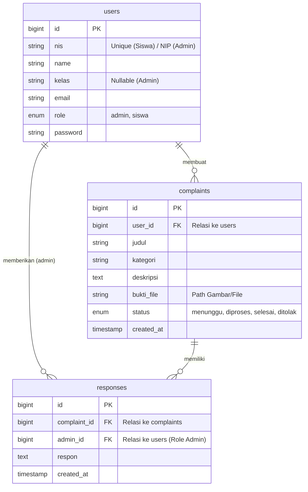

# Dokumentasi ERD (Entity Relationship Diagram)
## Aplikasi Pengaduan Sarana Sekolah

Berikut adalah desain database (ERD) yang digunakan dalam aplikasi ini, sesuai dengan implementasi kode program yang telah dibuat.

### 1. Diagram ERD (Mermaid)

### 2. Penjelasan Relasi & Kardinalitas

1.  **Users (Pengguna) ke Complaints (Pengaduan)**
    *   **Relasi:** *One-to-Many* (1:N)
    *   **Penjelasan:** Satu user (Siswa) bisa membuat BANYAK pengaduan. Satu pengaduan hanya dimiliki oleh SATU user.

2.  **Complaints (Pengaduan) ke Responses (Tanggapan)**
    *   **Relasi:** *One-to-Many* (1:N)
    *   **Penjelasan:** Satu pengaduan bisa memiliki BANYAK tanggapan (misal: update status berkala). Satu tanggapan merujuk pada SATU pengaduan spesifik.

3.  **Users (Admin) ke Responses (Tanggapan)**
    *   **Relasi:** *One-to-Many* (1:N)
    *   **Penjelasan:** Satu admin bisa memberikan BANYAK tanggapan. Satu tanggapan ditulis oleh SATU admin.

### 3. Struktur Tabel Utama

**Tabel: Users**
Menyimpan data semua pengguna, baik Admin maupun Siswa. Pembedanya ada di kolom `role`.
*   `id`: Primary Key
*   `nis`: Nomor Induk (Siswa: NIS, Admin: NIP/Username)
*   `role`: Penentu hak akses ('admin' atau 'siswa')

**Tabel: Complaints**
Menyimpan laporan pengaduan yang masuk.
*   `user_id`: ID pelapor (Foreign Key)
*   `status`: Status progres ('menunggu', 'diproses', 'selesai', 'ditolak')
*   `bukti_file`: Halaman bukti foto kerusakan

**Tabel: Responses**
Menyimpan balasan atau tindak lanjut dari sekolah.
*   `complaint_id`: ID pengaduan yang ditanggapi
*   `admin_id`: ID admin yang menanggapi
*   `respon`: Isi pesan balasan
