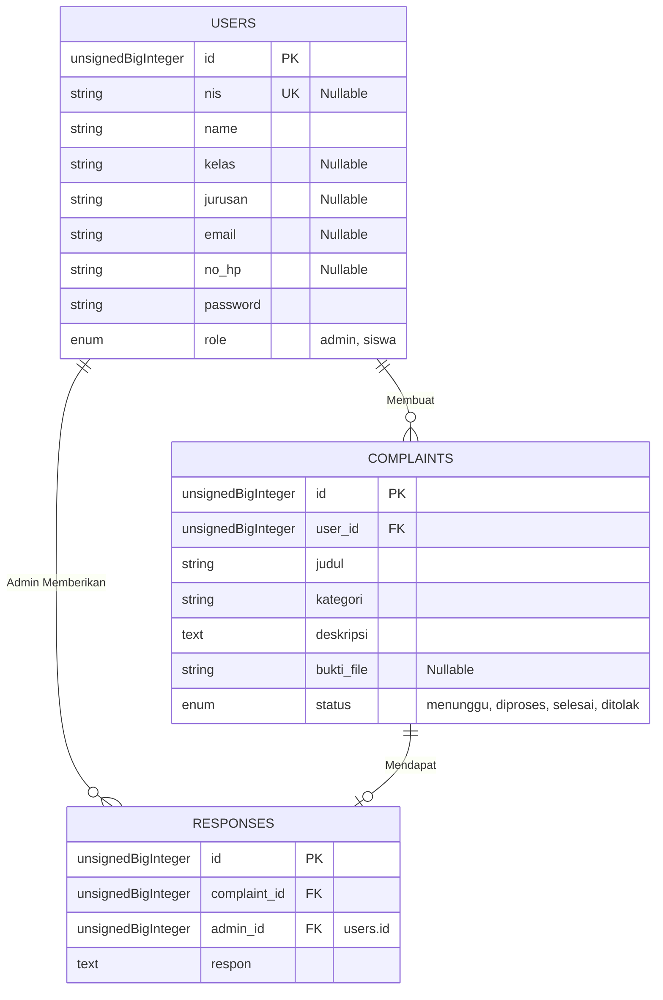

# Entity Relationship Diagram (ERD)
Aplikasi: Sarana Pengaduan Sekolah (LaporPak)

```mermaid
erDiagram
    USERS {
        unsignedBigInteger id PK
        string nis UK "Nullable"
        string name
        string kelas "Nullable"
        string jurusan "Nullable"
        string email "Nullable"
        string no_hp "Nullable"
        string password
        enum role "admin, siswa"
    }

    COMPLAINTS {
        unsignedBigInteger id PK
        unsignedBigInteger user_id FK
        string judul
        string kategori
        text deskripsi
        string bukti_file "Nullable"
        enum status "menunggu, diproses, selesai, ditolak"
    }

    RESPONSES {
        unsignedBigInteger id PK
        unsignedBigInteger complaint_id FK
        unsignedBigInteger admin_id FK "users.id"
        text respon
    }

    USERS ||--o{ COMPLAINTS : "Membuat"
    USERS ||--o{ RESPONSES : "Admin Memberikan"
    COMPLAINTS ||--o| RESPONSES : "Mendapat"
```
